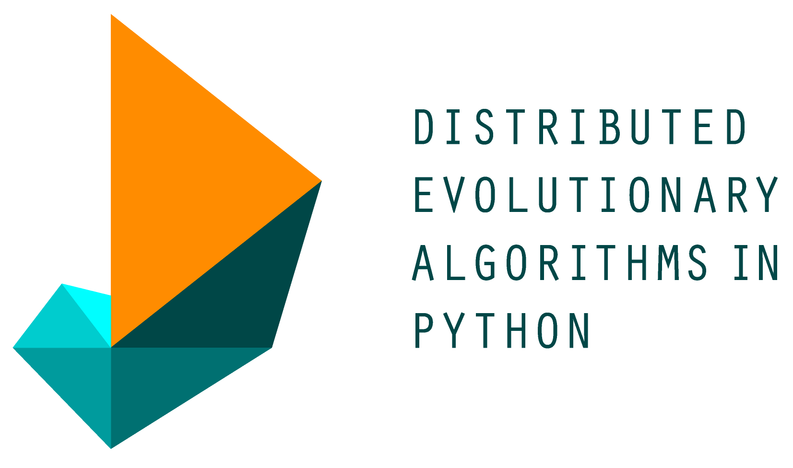
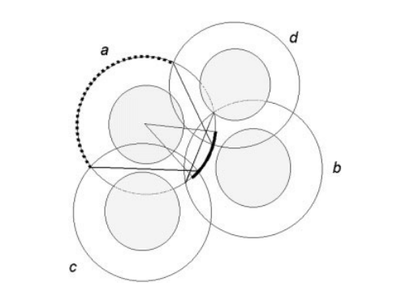

.. role:: cite

.. role:: citein

.. raw:: latex

    \providecommand*\DUrolecite[1]{\citep{#1}}
    \providecommand*\DUrolecitein[1]{\citet{#1}}

==========
Appendix A
==========

--------------------
Programmatic details
--------------------

Language and development environment choices
============================================
.. figure:: fig/python.png
    :height: 200 px

Python is a high-level scripting language that allows rapid prototyping. It provides object-oriented programming capabilities but does not compel you to use them. This allows the beginner programmer to combine procedural and OOP styles without any problems, and GAUDI takes advantage of it: the simpler modules are just a collection of related functions, while the most complex ones fully rely on Python classes and objects.

Thus, Python is usually regarded as one of the easiest languages to learn. Furthermore, its compulsory indentation syntax enforces code readability. Since Chimera and DEAP are both open-source, this former characteristic has helped understand a lot of the code patterns that happen behind the scenes of a molecular visualization tool and an evolutionary programming framework, respectively.

|

.. figure:: fig/titleChimera.png

UCSF Chimera is developed by the Resource for Biocomputing, Visualization, and Informatics, in the University of California, San Francisco (supported by NIGMS P41-GM103311). It is defined by its authors as *a highly extensible program for interactive visualization and analysis of molecular structures and related data, including density maps, supramolecular assemblies, sequence alignments, docking results, trajectories, and conformational ensembles*. UCSF Chimera includes a lot of Python packages that behave as *plugins* that extend its base functionality. Besides providing GAUDI with a robust visualization tool and a three-dimensional canvas, some of those plugins have been been incorporated into the GAUDI core, such as the H Bond discovery utility or the clashes and contacts detector. 

|

However, UCSF Chimera does not carry a built-in evolutionary algorithm, that's why an additional package was needed. DEAP stands for Distributed Evolutionary Algorithms in Python and, in words from its authors, is *a novel evolutionary computation framework for rapid prototyping and testing of ideas that seeks to make algorithms explicit and data structures transparent*. It provides GAUDI with the main GA engine, whose high customizability has allowed to implement very complex data structures, as required by a molecular design problem. Its transparent approach, as opposed to the majority of the other available evolutionary frameworks, has allowed us to design custom individuals that can confront the design challenge with agility. A typical GAUDI individual includes information about the building blocks and the resultant molecule, its torsion angles, the protein cavity chemical environment or the Cartesian transformation matrices, among others. However, since some GAUDI essays do not need torsion angles or rotamer changes, the GA individuals must be dynamical and only include what is needed in each case, and DEAP has proved to be invaluable in that matter.

Main features of GAUDI
======================

1. Hydrogen bonds discovery
----------------------------

Possible hydrogen bonds are calculated with the built-in Chimera extension ``FindHBonds``, which in turn is based on the studies by :citein:`Mills1996`. Mills et al surveyed the Cambridge Structural Database to derive real-life information about the distances, angles and atoms implied in ligand-receptor interaction. The implementation in Chimera allows to specify a tolerance threshold for both angle and distance, relaxing the geometrical constraints. By default, these have been set to 20 degrees and 0.4 Angstrom, respectively. 

In the current implementation, it only serves as a qualitative indicator of how many hydrogen bonds could be formed in the current state. Also, a set of *preferred* H-bond-forming atoms can be specified in the input. If the user decides so, it will account for an extra objective that will be maximized. This allows to use the existent literature and knowledge on the system to perform some prioritization on the protein atoms that could be implied in forming a hydrogen bond.

2. Clashes and contacts detection
----------------------------------

Both types of interactions are calculated with the same built-in Chimera extension ``DetectClash``. The base implementation only detects which atoms are within a set threshold from each other. GAUDI extends this basic functionality with some approximative functions based on the distance between the involved atoms.

A *contact* score is defined by a 12-6 Lennard-Jones-like expression which takes the form of:

.. math::
    
    LJS = (\frac{z}{d})^{12} - 2(\frac{z}{d})^6

, where :math:`z = 0.98*(r_a + r_b)`, being :math:`r_a` and :math:`r_b` the radii of the two involved atoms, and :math:`d` the distance between them. Since this LJ-like expression takes no constants, no units are provided.

To calculate the clashes, a different strategy is used. The reasoning behind this is founded on the need of a more sensitive method to quantify the clashing. Lennard-Jones approaches tend to be quite harsh on the clash part, so a more soft approach was needed. Thus, the *clash* scores are calculated as the overlapping volume of the Van der Waals spheres of the involved atoms. The volume is calculated analytically as proposed by :citein:`Eyal2004`:

.. math::
    
    V_ab = \frac{1}{3} \pi h^2_a(3R_a-h_a) + \frac{1}{3} \pi h^2_b(3R_b - h_b)

, where :math:`h_a = \frac{R^2_b - (d - R_a)^2}{2d}`, :math:`h_b = \frac{R^2_a - (d - R_b)^2}{2d}` if :math:`(d < R_a + R_b)`, and :math:`h_a = h_b = 0`, if :math:`(d \ge R_a + R_b)`. This means the clash score is expressed in :math:`nm^3`. 

3. Solvent accessible and excluded surface area calculation
------------------------------------------------------------
Solvent accessible and excluded surface areas (SASA and SESA, respectively) are calculated using the MSMS package :cite:`Sanner1996` and the built-in Chimera Python interface. Both SAS and SES areas shed light on solvation and desolvation terms, but SASA seems to be more commonly used when computing desolvation energies due to their strong linear relationship :cite:`Wang2002,Dynerman2009`. At any case, GAUDI supports both kinds of areas and it's up to the researcher to choose between maximizing SESA or minimizing SASA.

    Temporary image taken from (Eyal, 2004) that depicts the SASA and SESA concepts. To be substituted by one of my own.

4. Meeting a distance objective
--------------------------------
This is probably the simpler method implemented in GAUDI, but also one of the more powerful. Given a list of ligand atoms (``probes``) and a protein atom (``target``), it will optimize the average distance of each ``probe`` and the ``target``. Atoms must be provided using their serial numbers. Furthermore, a special keyword ``last`` is also available, and it represents the terminal atom of the ligand; i.e., the ``acceptor`` atom with the highest serial number, as defined in the ``attr`` file. See section 7 for more information.

5. Flexibility of the ligand
------------------------------
Flexibility on the ligand is achieved by taking advantage of the torsion handlers in the core ``BondRot`` package of Chimera. The engine has been modified to detect amide bonds -- these kind of bonds are only able to flip in a cis/trans fashion -- and in-cycle bonds, which cannot be rotated.

GAUDI supports partial flexibility, so it is possible to specify a maximum amount of torsion the ligand bonds cannot exceed. Thanks to simulated binary crossovers and mutations, there's no need to represent the torsion chromosomes as a binary string. This allows to achieve float precision for every torsion angle :cite:`Deb1995`, if needed. GOLD, on its behalf, uses a pure binary string in which each byte encodes a torsion angle. This approach allows allows a precision of 1.4 degrees :cite:`Jones1997`.

6. Rotamer and mutation retrieving
------------------------------------
UCSF Chimera offers a Python interface to Dunbrack's :cite:`Dunbrack1994` and Dynameomics :cite:`Scouras2011` rotameric libraries. Both libraries are sorted by the observed frequency of each rotamer, so, given a residue type with phi and psi angles, every rotamer can be unequivocally accessed using an index. Thus, two parallel lists are maintained as separated genes: rotamer indices for every requested residue position, and, in the case of random mutations are allowed, the corresponding indices to a list that holds the requested mutation types. As for the genetic operators, GAUDI also performs simulated binary crossover and mutation on this two former genes.

7. Space exploration and recombination
----------------------------------------
Though GAUDI's primary objective is not directed towards classic docking essays, it does provide a simple exploration engine that can greatly extend the design opportunities. In its approach, GAUDI makes use of two independent transformation matrices: one contains the translation info, while the other addresses the rotation parameters. 

If a recombination event takes place, the matrices from each parent are multiplied and then, the two resulting matrices are interpolated to produce an intermediate transform which is later decomposed back into its translation and rotation components. The two new individuals inherit one matrix from one of the parents, and one from the interpolated matrix. Mutation is handled in a simpler fashion: the new matrices are generated randomly from scratch, as in the initial population setup.

8. Ligand building
--------------------
UCSF Chimera provides no simple mechanism to build molecules interactively, let alone programmatically. It does include a package called ``BuildStructure``, but its current implementation is insufficient. GAUDI solves this lack with two custom classes: ``Molecule.Library`` and ``Molecule.Compound``. A ``Compound`` object can be instantiated from an existent ``Chimera.Molecule`` object or any file that Chimera can open. It provides several useful novel methods, such as ``append()`` or ``place()``. This allows to block-build a custom ligand just by appending several molecules on top and place the result in an adequate pose for later manipulation.

In order to properly handle the constructions, a separate ``attr`` file or Python dictionary must be provided. These attributes determine which atoms in the building block correspond will behave as an acceptor, donor, respectively. It can also contain a set of bonded atom pairs whose bond should not be rotated. These special roles are needed for the extended functionality of the ``Compound`` class. For example, the ``append()`` method will join the ``donor`` atom of the new molecule to the ``acceptor`` atom of the already present molecule.

The ``Library`` class was designed to implement lazy loading. If GAUDI were to hold all the ligands that can be built from the input blocks, it would soon run out of memory and crash -- especially considering how memory intensive Chimera tends to be :cite:`ChimeraMemoryUsage`. Subsequently, the ``Library`` handles ``Compound`` objects creation and required elongations on a per-request basis. 
 

9. Input and output files
--------------------------
GAUDI uses YAML-formatted files for both input and output files. The parsing is done with an external package called PyYAML :cite:`PyYAML`. YAML is a human-readable serialization format, already implemented in a broad range of languages :cite:`Yaml2009`. Formally, GAUDI files consists of a number of dictionaries, whose values are dictionaries themselves. However, due to YAML high readability, it looks just like a typical indented list. This an excerpt from a sample input:

::

    protein:
        path: /home/jr/x/hyde/mol2/ethanol.mol2
        origin: 5
        radius: 10.0

    ligand:
    # if a path is submitted, all combinations will be generated
        path: /home/jr/x/03__projects/hemocyanin/input_no_subst/
        type: blocks
        flexibility: 360
        bondto: 1868

    rotamers:
        residues: [233, 109]
        library: dynameomics
        top: 8
        mutate: no

    objectives:
        - name: Clashes
          type: contacts
          which: clashes
          weight: -1.0
          test: ligand
          threshold: 0.4
        
        - name: HBonds
          type: hbonds
          weight: 1.0

The only possible draw-back is that YAML, like Python, has meaningful indentation. This is particularly important in the list of objectives, which is actually a dictionary whose only value is a list (hence the hyphens) of sub-dictionaries. If the indentation is not respected, the parsing won't succeed.
