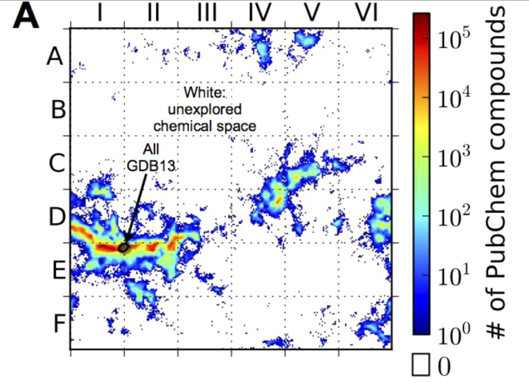
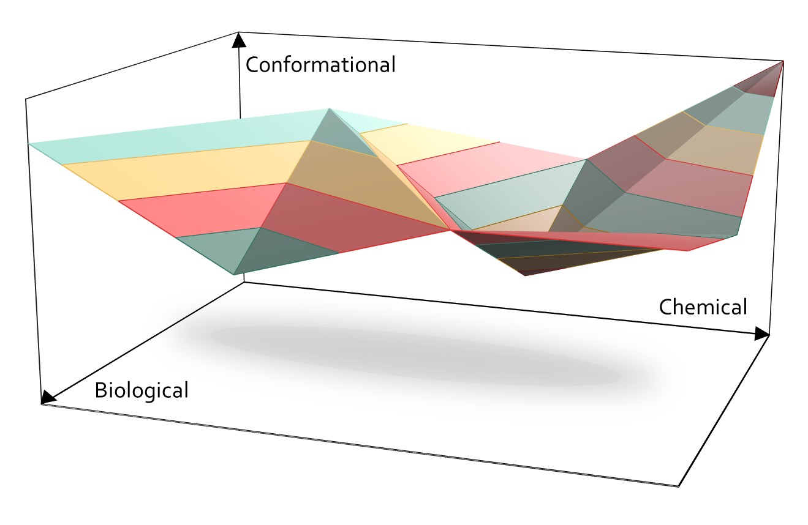

.. role:: cite

.. role:: citein

.. raw:: latex

    \providecommand*\DUrolecite[1]{\citep{#1}}
    \providecommand*\DUrolecitein[1]{\citet{#1}}

============
 Chapter 01
============

------------
Introduction 
------------

The so-called small molecule universe (SMU), which accounts for all the possible molecules whose molecular weight is smaller than 500 Da, is thought to comprise more than :math:`10^{60}` compounds. Though according to :citein:`Bohacek1996` only an infinitesimal part of it it's actually explored --- one part in :math:`10^{50}` --- this number is much greater than the estimated number of naturally-occurring chemicals, **XXXX** molecules **#!CITE**. Where do all those new molecules come from? The answer is molecular design. Since our early ages, we have been creating new compounds, even without knowing it or unintentionally. However, as new challenges arise, more rational approaches are required. Molecular design is the art of creating new compounds to satisfy a given set of target properties.

Thus, it's not surprising that computer-assisted molecular design is becoming an increasingly demanding area :cite:`Hoffer2013,Tang2014,Hoksza2014`. However, it is also a field where scientists are lacking specific software implementations. This is especially true in hybrid disciplines, such as chemobiological systems, where already existent solutions cannot face the high dimensionality it presents: all three chemical, biological and conformational axes need to be explored at once. If the chemical space was already immense, the chemobiological one is simply unfathomable. 

	Beratan and coworkers have mapped the small-molecule universe by means of a new computer algorithm called ACSESS (Algorithm for Chemical Space Exploration with Stochastic Search) that divides the chemical space in a six-by-six grid. Horizontal axis explains **XXXX**, while vertical axis details **XXXX**. The resulting map is mostly white (see fig. 1), which means that, despite having synthesized more than 100 million compounds, scientists have been focusing on the same regions over and over. This suggests that if new molecular design approaches are established, new regions would be visited and *brought to life*. A whole new world of possible solutions is simply waiting for us. *not very sure about this last sentence*. Taken from :citein:`Virshup2013`

To help visualize the dimensions of the problem, we can take a look at existing procedures. Standard docking problems are dedicated to find a suitable spatial accommodation of a small ligand inside a protein pocket. Even though docking programs only have to explore the conformational axis, they cannot afford forcefield-mediated energy calculations and the are left with simple scoring functions. Besides, docking is a process in which 90% of the leading forces have to do with non-covalent interactions **#! cite needed**, while molecular design is closely linked to covalent bonding and metal coordination, a marginally considered aspect in most cases. Indeed, one of the most promising fields in chemobiological design is the creation of artificial enzymes that combine well-known biological scaffolds with established industrial catalyst systems, which usually include transition metal centres, thus allowing exotic chemical activities to take place in a biocompatible environment. This aspect makes the problem slightly more complicated since the aforementioned metal moieties tend to be lowly parametrized in standard forcefields. All of these aspects leave energy calculations mostly out of scope.

Additionally, when it comes to creating a brand-new ligand that fulfil a set of given criteria, the researcher must visit both the chemical and biological space; i.e., to take into account the possibility of having different chemical modifications in crucial points of the molecule in order to, for example, guarantee a certain type of interaction with a central residue that is needed for the reaction to take place. Furthermore, in biological contexts, chemical modifications tend to mean *directed mutagenesis of aminoacids*, which can have more structural consequences than a simple group variation. This dual aspect further enlarges the search space that molecular design has to deal with.

All of these issues result in a huge space in which an accurate representation of the problem cannot be afforded, so an alternative strategy must be applied. Our objective is to provide a program that can deal with all these problems by delivering an easy-to-deploy interface that can respond to commonly asked questions in the molecular design world.

	The chemobiological space can be studied in terms of three main axes: conformational, chemical and biological variations. Standard docking essays only move in the conformational axis and they already require a simplified expression of binding energies to help face their search space. Pharmacophore studies add some details from the chemical plane, but do not handle a lot of biological variations. Adding full biological and chemical axes further enlarges that space, presenting a challenge that demands novel software solutions. 

2. Current molecular design in silico strategies
================================================
Over the years, several design strategies have been applied with more or less success. While the chemobiological search space can be huge, it is also discrete, meaning that each candidate solution can be uniquely characterized by its structure and atomic components. With this in mind, some attempts have gone for exhaustive enumeration, in which a part of the search space is explored sequentially. Though it may seem inefficient, it has produced relevant results, as proved by :citein:`Fink2007`.

Exhaustive enumeration can work well if the constraints are limiting enough to reduce the search space to a feasible portion, but with bigger problems it is no longer the case. One alternative is to classify the enumerated elements in branches so, if the elements of one branch are detected as fruitless, they can be removed at once by pruning that branch. These algorithms are called *Branch and Bound* (BB) and have been implemented successfully in several fragment-based drug designs :cite:`Hajduk2007`.

However, the applicability of BB is limited and in some cases stochastic techniques are very much preferred, such as Monte Carlo-like algorithms (MC) :cite:`Das2008`, or even evolutionary approaches (EA) --- particularly, genetic algorithms (GA). This former group of strategies are extensively used in docking programs, like GOLD :cite:`Jones1997` or AutoDock :cite:`Trott2010`. Evolutionary algorithms are a common choice because they deal with several candidate solutions at once, which is also the case in these multi-objective optimization problems. This common partnership will be further detailed in chapter 3.

A recent advance proposes a new paradigm that focus on inverse relationships. Instead of enumerating a series of ligands and testing their fitness to the problem, inverse molecular design rely on optimizing molecular property functionals with respect to a limited number of chosen variables :cite:`Huggins2009`.

2.1 Existent software have some limitations
-------------------------------------------
Though the number of available molecular design programs is not little by any means, zero to none can be actually used to deal with chemobiological problems. For example, one could use Baker's Rosetta modelling tool to design a suitable protein scaffold :cite:`Combs2013` provided that no metals are involved, since this platform is strictly for bioengineering problems. 

While Schrodinger LLC offers several commercial packages that could help in these new challenges, such as Biologics Suite or Small-Molecule Drug Discovery Suite :cite:`schrodinger`, they are very focused on specific areas --- protein engineering and drug discovery, respectively --- which prevents the researcher from doing hybrid essays. Unfortunately, promising Accelrys' Materials Studio and Discovery Studio, now part of 3DS' Biovia :cite:`accelrys`, suffer from the same narrow point of view.

3. Facing design challenges as docking problems
===============================================
If the problem is simple enough to not require dynamical building, one could try using a docking protocol, but the researcher would soon find that most of the programs do not support metal ions at all or, if they do, he or she would face awful complications :cite:`Ortega-Carrasco2014`. These are main motivations behind this dissertation.

3.1 Covalent docking is still a chimera
---------------------------------------
Of all the available docking programs, only a few support covalent docking essays. GOLD does provide an option to anchor the ligand to one of the protein atoms, and so does AutoDock, but that's it. If a researcher wanted to try several anchoring points in a branched ligand, he or she would find that it is currently impossible. Let alone looking for possible H bonds or hydrophobic patches for a given set of atoms. 

Though alternative methods are available, they are not versatile enough to meet our requirements, or rely on modifications on existent programs that tend to be overly complicated :cite:`Katritch2007`. A promising new option called CovalentDock was released past year as a modification of the popular AutoDock. This novel program implements a new layer in AutoGrid to help screen the possible acceptors and donors in the protein and the ligand, which results in improved accuracy :cite:`Ouyang2013`. However, it only allows a single covalent bond and is clearly biased towards drug screening, resulting in a limited option for strict molecular design.

3.2 Metallic moieties and docking essays
----------------------------------------
GOLD or Glide are docking programs that support metal moieties in the protein but they were not designed to handle metal ions in the ligand itself. Though some attempts have been successful at extending this limitation with a series of tricks, such as substituting the metal elements with dummy atoms, these *hacks* force to consider the first coordination sphere of the metal as a rigid shell :cite:`Ortega-Carrasco2014`.

FlexX is another docking program that includes a knowledge-based approach to handle ligands with metallic centres and is able to predict coordination geometries and use that information as part of the docking process :cite:`Seebeck2008`. However, one of the challenges that artificial enzymes present is using exotic transition metals as an instrumental part of the reactivity. Since this kind of elements rarely appear on biological systems, we cannot conclude the effectiveness of FlexX until a thorough assessment is performed. 

.. raw:: latex

    \newpage
    \bibliographystyle{newapa}
    \bibliography{bibliography}