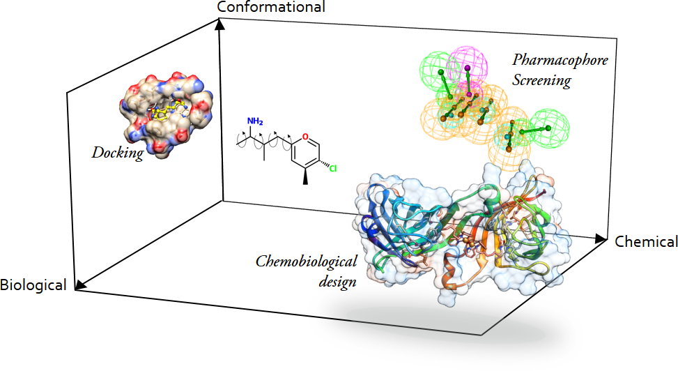

.. role:: cite

.. role:: citein

.. raw:: latex

    \providecommand*\DUrolecite[1]{\citep{#1}}
    \providecommand*\DUrolecitein[1]{\citet{#1}}

============
Introduction
============

1.1. The first steps
====================

Great part of the progress of humankind has been linked to the discovery of new materials, alloys or compounds. When molecules and atoms were not fully understood, we had to rely on fortunate events of serendipity and trial and error essays. However, as new challenges arise, being lucky is no longer an acceptable resource, and more rational approaches are required. One of our best attempts at solving these challenges is molecular design, the art of rationally creating new compounds to satisfy a given set of target properties.

Some of the first cases of success at creating new materials cannot be considered examples of molecular design, such as the first artificial dye (Perkin, 1856), or nitrocellulose (Chardonnet, 1889). More rational strategies were used as early as in XIX century, when trying to reproduce the properties of natural rubber by developing synthetic elastomers :cite:`rubber`. However, when we hear about molecular design, most of us first think of drug design, which focuses on the discovery or generation of new medications that can have a clinical effect based on prior knowledge of the biological target or the characterization of active compounds of therapeutic herbs. It usually comprises the generation of new derivatives of existent compounds that are later screened to assess their biological effect. To do so, traditional drug designers apply random chemical substitutions or combinatorial chemistry techniques. 

Unfortunately, the success rate of combinatorial strategies has been very limited and, to date, only one drug fully produced *de novo* using these techniques has been approved by the FDA and the EMA: sorafenib, a multi-kinase inhibitor :cite:`Newman2012`. This may be due to the fact that high-throughput screening essays do not really do *rational design*, but *elucidation*. In fact, they can be regarded as systematized attempts of benefiting from the aforementioned mere chance that expect that the solution will be among already characterized compounds. An alternative approach called *fragment based design* partially overcomes this limitation by the random combination of several small building blocks. While this approach does expand the visited chemical space, it still resorts to the aforementioned chance.

More specifically, the reasons behind this reduced success rate have been suggested to do with low diversity and limited exploration of the chemical space :cite:`Feher2002`. For example, the so-called small molecule universe (SMU), which accounts for all the synthetically feasible compounds under 500 Dalton, is thought to comprise more than :math:`10^{60}` compounds. Although according to :citein:`Bohacek1996` only an infinitesimal part of it it has been actually explored --- less than one part in :math:`10^{50}`. Beratan and coworkers have mapped the small-molecule universe by means of a new computer algorithm called ACSESS (Algorithm for Chemical Space Exploration with Stochastic Search). The result is a representative library of the SMU that consists of :math:`8.9*10^{6}` structures scattered along a 40-dimensional cartesian space whose axes are based on Moreau-Broto autocorrelation descriptors :cite:`Virshup2013` (see figure 1).

.. figure:: fig/uncharted_space.png 
	:align: center
	:height: 200 px

	*Stochastic voyages into uncharted chemical space produce a representative library of all possible drug-like compounds* :cite:`Virshup2013`. 

Figure 1.1 shows that along the first two axes of the principal component analysis of that 40-dimensional chemical space  reveals a map is mostly blank, which means that, despite having synthesized more than 100 million compounds, scientists have been focusing on the same regions over and over (an so has nature). For example, the GDB13 database, an enumerated library of compounds under 13 atoms which is the largest database of chemical structures currently available, only accounts for a strikingly-low 0.07% of the self-organizing map representation of the SMU. This could suggest that if new molecular design approaches are established, new regions could be visited and *brought to life*.
 
1.2. Chemobiology and the chemobiological space
===============================================
Creating new molecules and biomolecules stands on a series of physicochemical considerations that include different forms of interactions:

 - Covalent interactions. The creation of new strong bonds between atoms.
 - Coordination interactions. The use of metal and transition metals.
 - Non-bonding interactions. Van der Waals, dispersive forces, hydrogen bonds, polar interactions.

Chemobiological developments combine all the aforementioned interactions in a hybrid system that merges chemical compounds and biological moieties in a functional entity, such as in artificial enzymes, biosensors, biomarkers or supra(bio) molecular complexes. The creation of these systems result in a very high dimensionality which existent strategies cannot face easily: all three chemical, biological and conformational axes need to be explored at once (a simplified graphical representation can be seen on figure 1.2). 

 - The **conformational axis** holds all the possible geometric operations that a set of atoms can experiment, such as global translation and rotation or local torsion, rocking and bouncing. This kind of changes can make structures stable, unstable or metastable.
 - The **chemical axis** refers to the addition and removal of atoms in a molecule, as well as specific substitution of its functional groups. 
 - The **biological axis** explains residue mutations, and travelling all along the sequence of the species; mainly in its active regions. 

	The chemobiological space of hybrid chemobiological essays can be studied in terms of three main axes: conformational, chemical and biological variations. 

One could argue that the chemical and biological axes are redundant --- after all, biological structures are all about chemistry and, in fact, biological variations can be considered as a functional abstraction of a subset of the chemical space. However, biological modifications are treated separately because the nature of these changes are well described from the biochemical point of view; i.e., a mutation in a given residue can disrupt the structure of an alpha-helix, or a crucial disulfide bond could be broken.
 
To grasp an idea of the size of this highly dimensional space, we can think of standard docking essays. Although they only explore the conformational axis, they already require a simplified expression of binding energies to help face their search space. On its part, pharmacophore studies add some details from the chemical plane, but they do not handle a lot of biological variations. How could we even think of handling all the three axes simultaneously?

The real situation is even more complex, though. To take full advantage of these hybrid approaches, biotechnologists tend to make use of exotic organometallic centres that bring new kinds of reactivity to the table, as well as heavily modified aminoacids that generate novel structural scaffolds in a biocompatible environment, drastically enlarging the search space. All of this poses a challenge that demands novel strategies which allow explosive exploration of a hypervolume whose size does not allow an accurate representation. In fact, at the moment, both experimental and theoretical communities lack tools that would allow them to even start testing initial molecular hypothesis.

1.3. In silico strategies for molecular design
==============================================
Being able to test if a candidate molecular sketch is an acceptable solution for a given problem without the need of actually synthesizing it is an invaluable asset. Thus, it is not surprising that computer-assisted molecular design (CAMD) is becoming an increasingly demanded area in the field :cite:`Hoffer2013,Tang2014,Hoksza2014`. While CAMD have been proved successful in a decent amount of cases :cite:`Clark2006,Kubinyi2009`, most extended methods still suffer from the same diversity issues found in combinatorial chemistry, especially when it comes to hybrid disciplines that extend beyond traditional drug design, such as chemobiology. 

To date, computational strategies in molecular design only focus on reduced dimensions of the chemobiological space. Although the number of available molecular design programs is not little by any means, zero to none can be actually used to deal with all the variables that are relevant to generate chemobiological hybrids. Not even for a mere sketch. Indeed, most are concentrating on aspects related to protein engineering and drug discovery. With the increase of the quality of molecular modelling tools, many commercial packages now offer platform towards both fields --- i.e., Schrodinger LLC offers several commercial packages that could help in these new challenges, such as Biologics Suite or Small-Molecule Drug Discovery Suite :cite:`schrodinger`, as well as Accelrys' Materials Studio and Discovery Studio, now part of 3DS' Biovia :cite:`accelrys`. Those programs generally focuses on simulating three majors following developed: 

1.3.1. Protein-ligand docking and virtual screening
---------------------------------------------------
Existing computational procedures used in potein-ligand dockings are dedicated to finding a suitable spatial accommodation of a small ligand inside a protein pocket. This is mainly a conformational problem that is not really aimed at the exploration of the chemical space or the biological space (axis X and Y, figure 1.2). Fully visiting both axes at once is not very common, and if they even do it, existing solutions tend to only consider small slices of that additional dimension. These extra detours are usually performed with a second set of calculations like in virtual screening or approaches based on library search, thus starting with an already biased subspace that could have neglected some good candidates for this second stage.

1.3.2. Conformational exploring
-------------------------------
Molecular Dynamics, Monte Carlo #! 

1.3.3. Tree ordering and statistical analysis
---------------------------------------------
Other strategies have been applied with more or less success too. While the chemobiological search space can be huge, it is also discrete, meaning that each candidate solution can be uniquely characterized by its structure and atomic components. With this in mind, some attempts have gone for exhaustive enumeration, in which a part of the search space is explored sequentially. Though it may seem inefficient, it has produced relevant results, as proved by :citein:`Fink2007`.

Exhaustive enumeration can work well if the constraints are limiting enough to reduce the search space to a feasible portion, but with bigger problems it is no longer the case. One alternative is to classify the enumerated elements in branches so, if the elements of one branch are detected as fruitless, they can be removed at once by pruning that branch. These algorithms are called *Branch and Bound* (BB) and have been implemented successfully in several fragment-based drug designs :cite:`Hajduk2007`.

However, the applicability of BB is limited and in some cases stochastic techniques are very much preferred, such as Monte Carlo-like algorithms (MC) :cite:`Das2008`, or even evolutionary approaches (EA) --- particularly, genetic algorithms (GA). This former group of strategies are extensively used in docking programs, like GOLD :cite:`Jones1997` or AutoDock :cite:`Trott2010`. Evolutionary algorithms are a common choice because they deal with several candidate solutions at once, which is also the case in these multi-objective optimization problems. This common partnership will be further detailed in chapter 3.

A recent advance proposes a new paradigm that focus on inverse relationships. Instead of enumerating a series of ligands and testing their fitness to the problem, inverse molecular design rely on optimizing molecular property functionals with respect to a limited number of chosen variables :cite:`Huggins2009`.

1.3.4. Enzyme design
--------------------
Commercial packages now offer bioengineering tools that allow, at most, seeing the effect of a few mutations on the physicochemical properties of the system. Designing an enzyme from scratch is still far from our current possibilities. It would mean being able to accurately predict the folding of a given sequence of residues, one of the main unsolved problems in biochemistry. As of today, scientists have to be content with optimizing already existing proteins. The technique involves screening a protein database to find an adequate starting point and the optimize its active site to allocate a given transition metal through a series of directed evolution cycles. As of today, David Baker :cite:`Khersonsky2011,Althoff2012` and Stephen L. Mayo :cite:`Privett2012` have been successful at it by using slightly different approaches. These two examples prove that CAMD can actually help in the design of new enzymes, but they also point that the technique is still in development and that several experimental steps are still needed.

1.4. Limitations of nowadays tools for biochemical design
=========================================================
The building of some artificial chemobiological entities can be described as a complex docking problem where, in addition to standard non-bonded interactions, bonded, covalent interaction as well as combinatorial considerations are necessary. Such aspects are out of the scope of standard molecular modelling tools: while molecular design is closely linked to covalent bonding and metal coordination, a marginally considered aspect in most cases. The following sections will discuss the different limitations found nowadays.

1.4.1 Covalent bonds
--------------------
Of all the available docking programs, only a few support covalent docking essays. GOLD and Glide's CovDock :cite:`ToledoWarshaviak2014` do provide an option to anchor the ligand to one of the protein atoms, and so does AutoDock, but that's it. If a researcher wanted to try several anchoring points in a branched ligand, he or she would have to mimic all the covalent bonds sequentially, one bond at a time. Let alone looking for possible hydrogen bridges or hydrophobic patches for a given set of atoms. 

Though alternative methods are available, they are not versatile enough to meet our requirements, or rely on modifications on existent programs that tend to be overly complicated :cite:`Katritch2007`. A promising new option called CovalentDock was released past year as a modification of the popular AutoDock. This novel program implements a new layer in AutoGrid to help screen the possible acceptors and donors in the protein and the ligand, which results in improved accuracy :cite:`Ouyang2013`. However, those programs are purely aimed at dealing with one or two covalent bonds at the most in order to reproduce the mechanism of the few covalent drugs (i.e., AZT). Nothing exists to deal with a random and automatic generation of multiple covalent bonds like those necessary for the design of hybrid biochemical systems, such as small peptides or artificial enzymes.

1.4.2 Metal and coordination bonds
----------------------------------
GOLD or Glide are docking programs that support metal moieties in the protein but cannot predict how metals --- naked or embedded --- behave in wider systems like organometallic molecules or nanoparticles. Though some attempts have been successful at extending this limitation with a series of tricks, such as substituting the metal elements with dummy atoms, these *hacks* force to consider the first coordination sphere of the metal as a rigid shell :cite:`Ortega-Carrasco2014`.

FlexX is another docking program that includes a knowledge-based approach to handle ligands with metallic centres and is able to predict coordination geometries and use that information as part of the docking process :cite:`Seebeck2008`. However, one of the challenges in building chemobiological hybrids is using exotic transition metals as an instrumental part of the reactivity. 

1.4.3 Conformational exploration of the chemobiological space
-------------------------------------------------------------
Dealing with conformational, chemical and biological changes to travel in the chemobiological space is one of the grails in molecular modelling. Nowadays, most docking strategies consider almost of degrees of freedom of the ligand with the still challenging problem of cyclic systems. Moreover, the majority is able to consider some amount of conformational changes of the protein whether local (by including discrete displacement of the amino acids geometries; i.e., rotamers) or global (i.e., normal modes or molecular dynamics).

Actual mutation of protein residues are not that extended in most used software, since the consequences of such a vast change cannot be easily anticipated. Instead, current approaches resort to experimental techniques like directed mutagenesis to generate different protein scaffolds and then feed the program in use with the resulting crystallographic structures. 

With respect to the space concerning the ligand, if the problem is simple enough to not require dynamical building, just conformational variations, one could try using a docking protocol, but the researcher would soon find that most of the programs do not support metal ions at all or, if they do, he or she would face awful complications :cite:`Ortega-Carrasco2014`. If it does require dynamical construction, i.e., the ligand itself is not given and only a few building blocks and a couple of constraints are given, there is not a single piece of software that can even provide a few tentative sketches of the solutions.

1.5. Designing novel chemobiological hybrids: the search for an initial sketch
==============================================================================
An example of the most promising fields in chemobiological design is the creation of artificial enzymes that combine well-known biological scaffolds with established industrial catalyst systems, which usually include transition metal centres, thus allowing exotic chemical activities to take place in a biocompatible environment. 

As discussed, working on these systems with existent solutions forces the researcher to push the boundaries of the programs to untested situations, usually resorting to workarounds for which the software were not designed to. Avoiding dirty tricks like these and providing a straight-forward platform that can cope with these experiments out of the box are some of the main motivations behind this dissertation. Thus, our objective is to provide a molecular-sketching platform that can deal with all these problems by delivering an easy-to-deploy interface that can respond to commonly asked questions in the molecular design world.