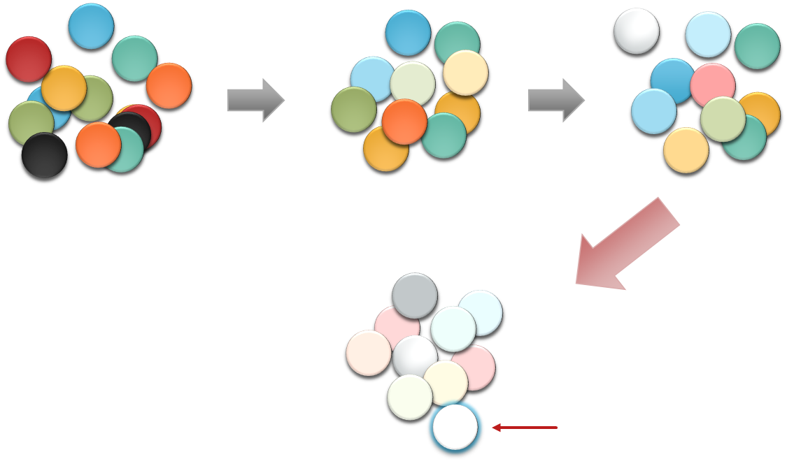
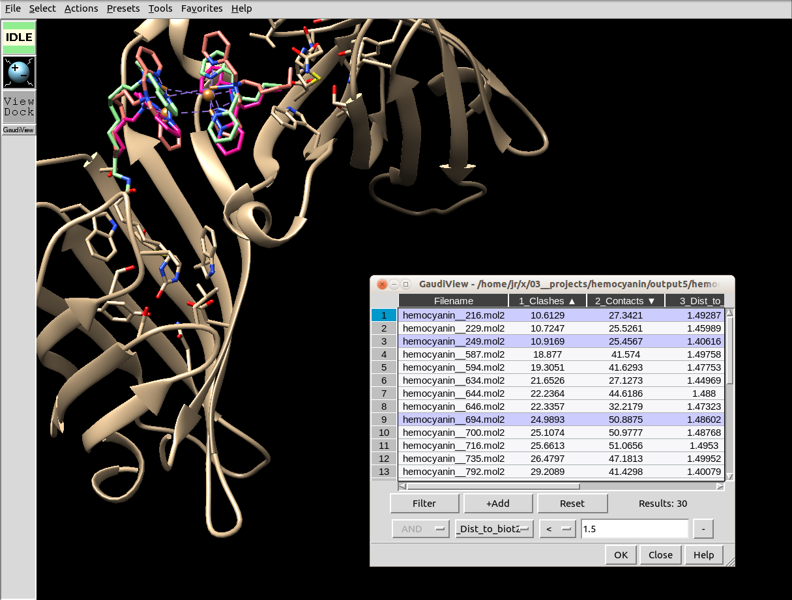

.. role:: cite

.. role:: citein

.. role:: latex(raw)
   :format: latex

.. raw:: latex

    \providecommand*\DUrolecite[1]{\citep{#1}}
    \providecommand*\DUrolecitein[1]{\citet{#1}}

=============================
Introducing GAUDI\ :sub:`ASM`
=============================

|

3.1. What is GAUDI\ :sub:`ASM`
==============================
Chemobiological researches are often challenged with molecular design tasks that combine several types of compounds, proceeding from  biological to chemical environments, including organic and inorganic structures. These hybrid systems are, by far, much less studied than their individual parts, which results in an obvious lack of software tools that can help to confront the challenges they propose. For example, we can easily find conformational explorers like Confab :cite:`OBoyle2011` or Balloon :cite:`Vainio2007`, but they just focus on a single axis of the multidimensional space that must be explored. A fresh approach is needed, and that is the blank GAUDI\ :sub:`ASM` will try to fill.

**GAUDI**\ :sub:`ASM` stands for **G**\ enetic **A**\ lgorithms for **U**\ niversal **D**\ esign **I**\ nference and **A**\ tomic **S**\ cale **M**\ odelling. It consists of a novel platform that aims to satisfy an increasingly demanding area in molecular design: artificial chemobiological systems. It does so by providing the researchers with a powerful multi-objective optimization engine to simultaneously explore all the variables (the three axes exposed in the introduction on figure 1.2) that compose the huge search space chemobiological design problems usually present. Given a customizable list of objectives, GAUDI\ :sub:`ASM` will optimize the given compounds to simultaneously satisfy all the requested criteria.

3.2. The methodology: Genetic exploration with multi-objective capabilities
===========================================================================
Most real-life optimization problems comprise several (usually conflicting) objectives, but they tend to focus on just one of them, describing the remaining ones as restraints :cite:`Konak2006`. If we were to buy a car with the most powerful engine but also the most environmental friendly, and the cheapest possible price, we would probably set a maximum price and then decide on an acceptable compromise between power and eco-friendliness. However, this kind of strategy is not really solving the optimization problem, since it starts by discarding a portion of the search space; i.e., setting a restraint on the price\ :latex:`\footnote{Objectives and restraints may seem to refer to the same concept, but during this dissertation a slight difference will be made. While objectives are treated independently of other decision variables, restraints are not. Objectives rule the calculations and are assisted by the limits imposed by the restraint. This doesn't happen the other way around: a variable expressed as a restraint will not worsen the situation of a variable expressed as an objective because the experiment has been designed to satisfy the requirements of the so-called objective.}`.

Molecular design are multi-objective optimization problems, but they are not usually treated as such. Most of the existent approaches consist of an energy minimization or other conformational exploration processes guided by a set of user-provided restraints. As a result, this strategy provide a solution under a very restrictive combinatorial space and may be leaving a lot of the possible solutions out of scope. Why would we want to renounce to any chances of finding the right molecular construction that will solve our problem?

Having multiple objectives implies that the concept of a single *optimum* solution is no longer valid. Instead, multi-objective optimization algorithms usually propose a set of good *trade-offs* between the  variables to consider :cite:`Coello2007`. This idea is known as *Pareto optimality*, as enunciated by Wilfredo Pareto in his studies of income distribution.

Given a set of candidate solutions, a Pareto improvement is a change that can make at least one solution better off, without worsening the situation of the other candidate solutions. When no further Pareto improvements can be applied on the set, that set is said to be *Pareto optimal*. The so-called *Pareto front* is the set of all the Pareto optimal solutions, and, in principle, all of them are good answers to the problem. With ``n`` dimensions or objectives, the Pareto front can be depicted as a hypersurface that hosts the optimal solutions of the hypervolume\ :latex:`\footnote{While hypervolume refers to a n-dimensional space (more than three dimensions), hypersurface refers to the a reduced (n-1)-dimensional version of that space.}`.

Finding the true Pareto front can be difficult, but it can be approximated by a rich set of non-dominated solutions. A solution ``a`` is set to dominate solution ``b`` if it solves at least one of the objectives better than ``b``, without losing to ``b`` in any of the remaining objectives :cite:`Deb1999`. ``a`` dominates ``b`` if it makes for a better answer to the problem; in other words, non-dominated solutions are closer to the solution than dominated ones. Dominance is one of the key aspects of multi-objective optimization, and is used extensively in well-known algorithms such as NSGA-II :cite:`Deb2002`.

Using multi-objective optimization algorithms allows us to efficiently examine all the decision variables at once, avoiding the design of sequential workflows that work on a single aspect at a time. For example, instead of optimizing the length and mass of the compound, then looking for appropriate chemical substitutions and finally finding the proper orientation inside the binding pocket of the protein, we can just enter all the parameters into the input and let the optimization process do its work. It is not only more comfortable for the user, but also more efficient and exhaustive, since it avoids losing candidate solutions that could have been welcome in forthcoming stages of the optimization.

3.2.1. Dealing with several solutions at once
---------------------------------------------
As using Pareto optimality criteria usually means working with multiple solutions, it makes sense to use exploration algorithms that can deal with several candidate solutions at once. One of the most common choices is to use genetic algorithms (GA). GAs are part of evolutionary algorithms, which, as their name states, are heavily inspired by Darwin's evolution theory. In fact, they take a lot of the nomenclature from it. For example, a candidate solution is called *individual*, whose terms, variables or parameters are named *genes* or *chromosomes*. The ground idea is to expose the candidate solutions to an evolutionary simulation, in which the fitness of the individuals is determined by an evaluation function that runs the optimization process. 

A simple GA starts by generating a random set of *individuals*, the so-called initial *population*. Then, that population is exposed to a series of evolutionary operators, such as gene mutation, chromosome recombination or, in some approaches, migration. As a result, a new set of individuals is produced by the parent population. Some of them will be *fitter* than their preceding counterparts, some of them not. That's why all of them are tested by the evaluation function, which will return their *fitness* in the form of a score. Only the fittest individuals will be allowed to continue in the solutions pool or, in biological terms, *selected* to take part in the next *generation* :cite:`Goldberg1989,Mitchell1998`.

	Genetic Algorithms simulate evolution in a randomly-generated population of possible solutions. 
	Each generation, the best solutions are selected and allowed to exchange and mutate their terms, thus contributing to improve the overall fitness of the population. After a number of generations, a set of good-enough individuals is usually found. In this example, we are trying to generate a white circle (RGB-coded as 255,255,255) from a population of randomly-coloured circles by maximizing the sum of the colour indices. One of the first consequences of the simulated evolution is the loss of the black circles (RGB-coded as 0,0,0), which do not contribute to getting to the white colour. Soon enough, the results become apparent and the circles begin to show lighter colours. After n generations, the first white circle is found and, after enough iterations, the whole population would be white.
	If we needed to assess the radius of the circles too, we would have to rely on a second run of the experiment that started with a biased population of previously-selected circles. With a multi-objective optimization algorithm like the one GAUDI\ :sub:`ASM` uses, this is not a problem, since both axes can be evaluated simultaneously. There is no need for a fabricated weighted sum which would have no meaning since the importance of each parameter is not known beforehand.

After a few generations, the population will have evolved towards a reasonable set of solutions that approximate the Pareto optimal front. However, as the number of objectives increases, it becomes harder to accurately reconstruct the true Pareto front. In fact, it can consist of hundreds of solutions. To determine which one the researcher is really looking for, a scalarization technique must be applied --- after all, only a section of the hypersurface might be necessary. Of all the possible approaches, weighted sums are one of the most common due to their simplicity, but also encompasses a few limitations, such as knowing the importance and precedence of the different objectives beforehand :cite:`Hwang1979`. As GAUDI\ :sub:`ASM` mixes energetic, geometric and chemobiological criteria together, this cannot be anticipated easily; instead, GAUDI\ :sub:`ASM` returns the whole Pareto front, leaving the decision up to the researcher's own criterion and the visual advice provided by Chimera and GaudiView, GAUDI's accompanying GUI tool.

3.3. Main features
==================

GAUDI\ :sub:`ASM` relies on two main projects to achieve its functionality: UCSF Chimera :cite:`Chimera` and DEAP :cite:`Deap`, both written in Python. On top of these two main pillars, a custom framework during this Master thesis has been implemented to help guide molecular design essays. Further technical details of this implementation are discussed in Appendix A.

.. figure:: fig/pseudo.pdf
	:width: 200 px
	
	Pseudocode of the launcher script that is launched in every GAUDI\ :sub:`ASM` experiment.

3.3.1 Molecular design guided by evolutionary pressure
------------------------------------------------------
GAUDI\ :sub:`ASM` features a simple but powerful compoumd design tool that allows wider chemical exploration possibilities with respect to most actual software with similar purposes. Instead of providing a list of already built ligands, the user can input a list of alphabetically-sorted directories that contain individual molecular building blocks. GAUDI\ :sub:`ASM` will then parse the supplied files and build the resulting ligands on the fly, as requested by the genetic algorithm selection operators.

The builder does not impose any restraints on the building blocks, as long as they are formatted as standard mol2 files. By default, the blocks will be joined by the atoms that present the least and greatest serial number, respectively, but the user may specify any other atoms in an additional input.

This approach is versatile enough to explore the solution landscape in terms of spatial requirements (*"How many atoms would I need to build a ligand that can bridge these two subunits?"*) and chemical substitutions (*"Which groups should this ligand of 10 carbons feature so it can form an hydrogen bond with aspartic acid 100?"*). Thanks to the integrated parser, a short list of SMILES strings will suffice to launch an initial essay.

3.3.2 Biochemical and steric optimization of the search space
-------------------------------------------------------------
GAUDI\ :sub:`ASM` makes full use of Dunbrack's :cite:`Dunbrack1994` and Dynameomics :cite:`Scouras2011` rotameric libraries to optimize the conformational space of the protein. Just select the desired residues and , if desired, activate a mutation flag so that the algorithm randomly swaps the selected residue with any other natural amino-acid. This feature enables us to explore the search space in both conformational and biochemical dimensions. 

The ligand flexibility is also configurable. Instead of letting choose between *rigid* and *flexible*, the input file requires a maximum torsion angle that will determine the global flexibility. If is set to zero, it will behave as a rigid compound; setting it up to 360 will have the opposite effect. Any integer in between is acceptable, so it is possible to choose a reasonable torsion that will provide just the right amount of flexibility without losing the initial conformational information. 

3.3.3 Forcefield-less energetic terms
-------------------------------------
As of now, GAUDI\ :sub:`ASM` relies on four forces that are usually sufficient to guide the exploration in energetic terms. Specifically, it supports hydrogen bonds discovery (based on geometrical criteria, as proposed by :citein:`Mills1996`,  hydrophobic patches detection (expressed with a rough Lennard-Jones-like calculation, see equation A.1) and steric clashes (analytically calculated as overlapping Van der Waals volumes, as proposed by :citein:`Eyal2004`; see equation A.2), and solvent accessible and excluded surface areas calculations (based-off MSMS :cite:`Sanner1996`). Again, more technical details on these aspects are given in Appendix A. 

Artificial systems often take advantage of organometallic groups to produce new chemical reactions in a very precise chemospecific context. Because of the complexity to parametrize metal ions in force field and the crude approximation of their electronic nature in the scoring functions used in docking programs, standard molecular procedures are rather little adequate for metal containing systems. Since quantum mechanics are still a long way of being used in screening essays, true energetic terms are inevitably left out of scope. To help palliate this issue, GAUDI\ :sub:`ASM` proposes a workaround that exploits the multi-objective capabilities and provides several modules that try to resemble the most featured of metal bioinorganic interactions.

With this simple approach, metals can be happily part of both the protein and the ligand, overcoming one of the main limitations found in most of docking programs, which apparently have been ignoring this field of molecular design. In fact, nothing prevents us from using a metal ion as a ligand and optimize the surrounding rotamers to find a suitable coordination geometry, as it will be discussed in chapter 5.

3.3.4 GaudiView: A GUI explorer for complex sets of candidate solutions
-----------------------------------------------------------------------
As previously stated, multi-objective optimization processes often generate more than one possible solution to the problem. To help find the most suitable ones, the results of this thesis also includes a visual tool to help explore the Pareto Front produced GAUDI\ :sub:`ASM`: GaudiView. GaudiView has been tailored as a native Chimera extension that lazy-loads the whole range of solutions, no matter the size. Some complex experiment can produce thousands of candidate individuals, so the program must be both efficient and effective. Lazy-loading avoids long initial wait times, since the file is only loaded into memory when it's actually requested. This is the same approach that GAUDI\ :sub:`ASM` internally uses to build the ligands library on the fly.

Furthermore, the GUI tool includes multiple sorting and filtering utilities to help discern the adequate portion of the Pareto hypersurface. In some complex cases, the set of solutions may not include what the researcher would call a *perfect solution*, but he or she may be able to identify a *pretty good one* if some trade-offs are applied. Instead of performing another run, GaudiView allows to parse the whole Pareto front and retrieve the most promising results effortlessly.

Last but not least, a number of goodies have been included to add special visual support in some specific cases. GaudiView is able to provide effective integration channels with some powerful built-in tools of UCSF Chimera, such as the Metal Geometry utility or the MMTK minimizer. These premium features open the doors to a vertical integrative platform where the researcher would be able to obtain reasonably sound solutions by simply writing a list of objectives.

	GaudiView is a graphic user interface that helps explore the Pareto front of candidate solutions. It features multi-sorting and multi-filtering capabilities and can handle thousands of files thanks to a lazy-loading implementation that drastically reduces the needed amount of RAM.