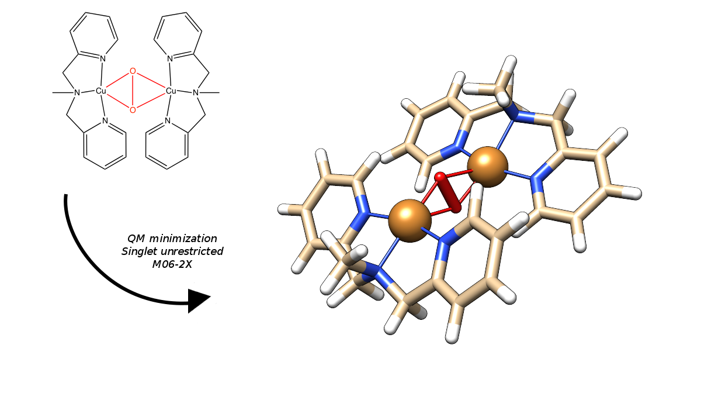
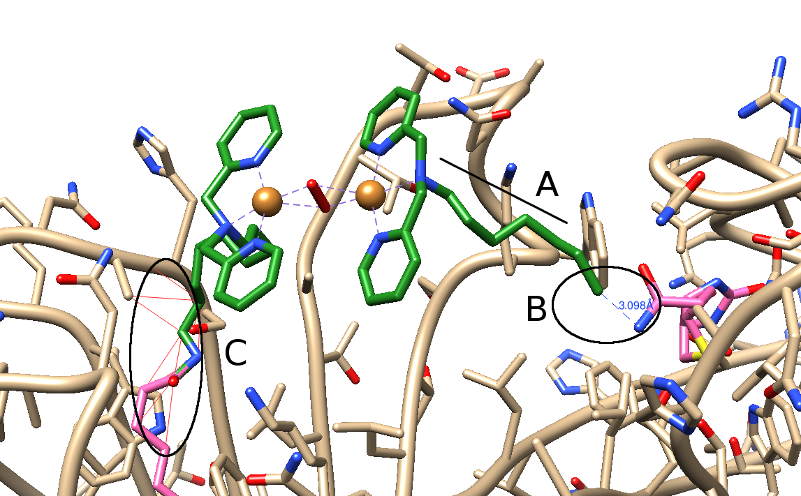
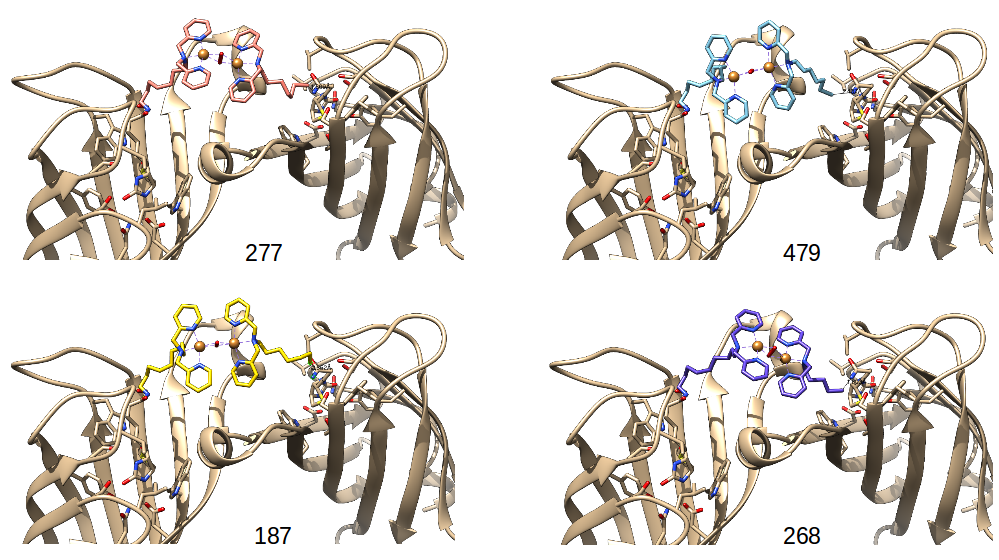

.. role:: cite

.. role:: citein

.. raw:: latex

    \providecommand*\DUrolecite[1]{\citep{#1}}
    \providecommand*\DUrolecitein[1]{\citet{#1}}

========================
Case Study I: Hemocyanin
========================

|

4.1. Enzymes and organometallics
================================
Life can be seen as a beautifully orchestrated succession of chemical reactions. Most of those reactions could not take place outside cells or, if they did, they would take an unaffordable amount of time. So, how do cells manage to do that? The answer lies in enzymes.

Enzymes are cell-tailored catalysts that provide the necessary environment for biological reactions to take place. The enzymes we know are the product of millions of years of evolution. During that period of time, nature has been sculpting their structure and functionality, so that they become better and better at doing their job. This results in a very specific chemospatial context that greatly lowers the energetic barrier of the transition state, allowing the reaction to happen at mild conditions in a very short period of time. 

To fulfil their role, most enzymes do not transform the substrate on their own. Instead, they are helped by a variable number of small diverse molecules called cofactors. One of the more interesting types of cofactors are transition metal compounds. Transition metals exhibit unique chemical properties due to their versatile electronic features which allows them to present a wide range of oxidation states and mechanistic routes absent from purely organic systems. 

Artificial metalloenzymes seek to combine the specificity of enzymatic biocatalysts with the reaction possibilities of organometallic groups in a single functional entity. Designing one of these hybrids systems from scratch is still far from being doable, but meanwhile some other less ambitious approaches have been reported successful, such as DNA-based catalysts :cite:`Roelfes2005` and several types of protein-based designs. In this former group, three main strategies can be detailed, based on the type of ligand anchoring: dative, covalent or supramolecular :cite:`Steinreiber2008`.

**Dative anchoring** (fig 4.1.A) features a chelation bond between the metal and some protein residues to ensure the localization of the inorganic moiety in the protein cavity. **Covalent anchoring** (fig 4.1.B) consists of covalently binding the cofactor to the protein active site using a reactive residue, such as serine or cysteine. **Supramolecular anchoring** (fig 4.1.C) takes advantage of strong non-covalent interactions between the protein receptor and its natural ligands, to which the organometallic catalyst will be covalently attached.

.. figure:: /home/jr/x/thesis/contents/fig/artificial_types.png
    :align: center
    :height: 200 px

    **Main strategies used in protein-based artificial metalloenzymes**. (A) X-ray structure of an artificial metalloprotein obtained by Watanabe and coworkers (PDB code: ``1V9Q``, :citein:`Ueno2005`). (B) Fiction model of an artificial system that uses a covalent anchoring strategy. (C) Artificial hydrogenase obtained by Ward and coworkers, which uses an extended biotin as an anchor to insert the inorganic cofactor inside the streptavidin (PDB code: ``3PK2``, :citein:`Ward2011`).

4.1.1 Streptavidin-biotin technology
------------------------------------
Biotin --- also known as vitamin B7 or H --- is the natural ligand of (strept)avidin, and they both make for a well-known couple in biology due to manifesting the strongest non-covalent interaction in nature: the dissociation constant gets up to :math:`K_d \approx 10^{-14}M` :cite:`Green1975`. The complex is also greatly resistant to extreme pH and temperature levels, organic solvents, proteolytic enzymes and other adverse conditions. All of these features make the system an excellent candidate for supramolecular anchoring techniques and biotechnological developments. So far, this has been one of the most successful strategies in the field. 

.. figure:: /home/jr/x/thesis/contents/fig/3pk2.png
    :align: center
    :height: 200 px

  **Streptavidin-biotin-based artificial hydrogenase**. Ward et al. are actively working on streptavidin-biotin based systems to implement diverse metallogroups. One of their results is an artificial hydrogenase (PDB: ``3PK2``, :citein:`Ward2011`), in which a catalyst (violet dye) is covalently linked to a biotin (grey dye) inside the streptavidin pocket (brown surface). This way, the biotin acts as an anchor that helps place the catalyst inside the streptavidin scaffold. 
    
4.1.2 Oxygen transport in invertebrates: hemocyanins
----------------------------------------------------
Hemocyanins are oxygen-carrier proteins that can be found in some invertebrate animals, such as snails, crabs, lobsters or spiders. The transport is achieved thanks to two copper atoms that reversibly bind an oxygen molecule. Oxygen-binding capabilities of copper often result in comparisons with biological iron, though some differences exist. For example, iron is usually found in tetrapyrrole coordinated compounds, while copper prefers imine-nitrogen atoms. In the case of hemocyanin, its two coppers coordinate to three histidines each, favouring the dioxygen binding in an global singlet electronic configuration (see figure 4.3).

.. figure:: /home/jr/x/thesis/contents/fig/1nol.png
    :align: center
    :height: 200 px

    Oxygenated form of *Limulus polyphemus*' hemocyanin. Hemocyanin features a histidine-coordinated di-copper centre that reversibly binds a single molecule of oxygen. (PDB: ``1NOL``, :citein:`Hazes1993`).

.. figure:: /home/jr/x/thesis/contents/fig/hemocyanin_schem_kiam.png
    :align: center
    :height: 120 px

    Oxidation reaction of the dicopper centre in hemocyanin. Taken from :citein:`Kaim2013`.

4.2. The challenge: an artificial hemocyanin
============================================
One of the new experiments Ward's group is working in is an artificial hemocyanin, built upon the streptavidin-biotin system in which the imine-nitrogen atoms are supplied by the biotin-anchored linkers. Several wet-lab attempts have been tried, but none of them have succeeded --- it may be due to unexpected hydrophobic interactions between the linkers and streptavidin, as well as an insufficient length of the linkers (to date, experimentally-tested linkers are aliphatic chains up to five carbons).

This novel design suggest the bridging between two organometallic subsystems for each monomer of the dimeric subunit of Streptavidin. So far, Streptavidin-based artificial enzyme designs have been limited to control a unique monomer site. The generation of an artificial hemocyanin represents therefore a step forward along the way of chemobiological design.

However, this novel idea further complicates the problem: existent software can barely handle a single covalent-like interaction, let alone two or more bonds. In order to shed light on the problem, a GAUDI\ :sub:`ASM` simulation was run based on the following experiment requirements.

    1. The hemocyanin core must be placed around the interface region of the two hemocyanin subunits.
    2. It must be covalently linked to the two biotins that reside in each of the afore-mentioned subunits.
    3. Two linkers of unknown length have to be used to connect the biotins with the hemocyanin core.

4.3. Our strategy
=================
The problem was implemented in GAUDI\ :sub:`ASM` following what we call an *anchor & seek* strategy. This approach consists of a covalent bond restraint on one end of the dynamically constructed ligand and one covalent-suitable distance objective on the other end.

The dynamical builder was fed with this overall structure: ``linker - hemocyanin core - linker``. The so-called ``linker`` block could be represented by any of the following compounds: ethane, propane, butane, pentane, hexane, heptane and octane. The initial ``hemocyanin core`` block was generated using a small biomimetic model of the hemocyanin binding site and then QM-minimized with Gaussian09 :cite:`g09` using a M06-2X functional (which features a 54% Hartree-Fock exchange), charge +2 and open-shell singlet configuration, as suggested by previous studies :cite:`Metz2001,Saito2014`. The resulting structure was then converted into a standard GAUDI-compatible Mol2 file, which was intentionally left rigid. 

    Ward's group supplied a draft of the di-copper centre, which was later converted into a standard mol2 file with ChemBio3D. The resulting file was then minimized with Gaussian09 using an M06-2X functional.

An initial population of 1000 individuals was created and evolved for 300 generations with a crossover probability of 0.8 and mutation rate of 0.1. Additionally, a main distance objective was asked: the free end of the ligand should approach the terminal-N of the biotin in the other subunit to meet a covalent-suitable distance. An idealization of the final requirements is depicted in figure 4.6.

    Partial idealization of required objectives. To obtain a feasible sketch, GAUDI\ :sub:`ASM` was fed with several objectives. The main ones are depicted in this figure. Both linkers are dynamical entities and are represented by an alkyl chain of a variable number of carbons (from 3 to 9). The number of carbons and their torsion angles (A) were optimized to meet a covalent distance objective between the terminal atom of the molecule and the terminal N of the 2nd biotin (B), while minimizing steric clashes (C) and maximizing Van der Waals interactions (not shown).

4.4. Discussion of results
==========================
The resulting Pareto front consisted of 1599 individuals, a selection of which was extracted following these score constrains in GaudiView GUI:
    
 - Clashes < 20 nm³
 - Distance to biotin < 2.0 A

What we first observed is that the needed length for the linker should go beyond the five-carbon linker that experimentalists were trying. In fact, according to the results, the linkers should contain between six and eight carbons each, thus favouring a 7C-symmetrical construction (see figure 4.7). Also, one candidate solution feature an eight-plus-four construction, suggesting that it could be enough with six carbons in each linker (still above the length tested experimentally). 

However, with such length, we would expect an excessive flexibility in the system, which suggests the use of some rigidifying modifications, such as inserting some unsaturations in the linker. We also observed some undesired hydrophobic interactions between the linkers and the inner faces of the binding cavity that prevented the system from reaching the second biotin. The addition of some polar groups to the linker is thus suggested.

While the proposed solutions have slightly different orientations, all of them were able to find a cavity in the interface of the monomers of the dimeric subunit of streptavidin, as it can be seen of figure 4.8. 

.. raw:: latex

    \begin{table}[h]
    \centering
    \caption{Selected hemocyanin poses.}
    \label{my-label}
    \begin{tabular}{@{}llllll@{}}
    \toprule
    Model & Linker A  & Linker B  & Distance to biotin & Clashes (nm³) & Contacts \\ \midrule
    277   & 8 carbons & 6 carbons & 1.809 A            & 10.6661       & 14.4928  \\
    479   & 8 carbons & 6 carbons & 2.437 A            & 14.6741       & 25.4074  \\
    187   & 8 carbons & 6 carbons & 2.652 A            & 9.46732       & 18.1877  \\
    265   & 8 carbons & 4 carbons & 1.803 A            & 10.5548       & 18.4069  \\ \bottomrule
    \end{tabular}
    \end{table}

    The four selected poses reveal different linker configurations while maintaining a similar pattern in the location of the core.

.. figure:: fig/hemocyanin-results-cavity.png 
    :height: 200 px

    The steric clashes detection engine allows easy recognition of the conformational space and provides physically sound compound poses. Here, the hemocyanin construction found a feasible cavity in the interface of the two monomers that compose the dimeric subunit of streptavidin.

Conclusions
-----------
Even at a early stage of development, GAUDI\ :sub:`ASM` has proved it can shed light on the problems that experimentalists are facing. A simple essay that took less than two hours revealed the main obstacle they were struggling with: the length of the linkers was insufficient. 

It also provided a visual picture of the system, and pointed out some of the difficulties they will have to deal: how would the system behave in a deoxygenated state? It will probably suffer from excessive chain movement, and resolving that issue may imply additional anchoring to the inner sides of the cavity. Further studies will be focusing on the approach of the side carbons in the N-rings of the copper scaffolds to residues K109 and K233, which may be able to facilitate additional anchoring to help fix the long chain.
